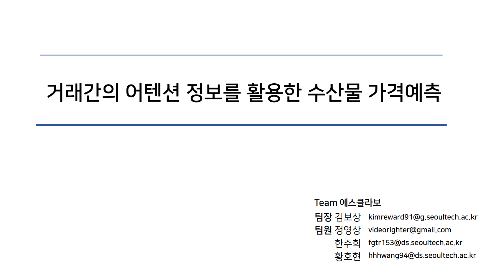
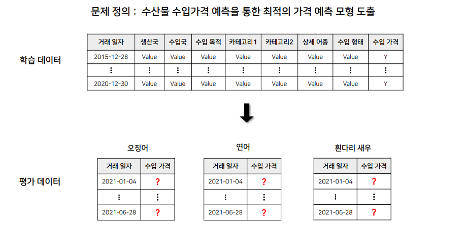
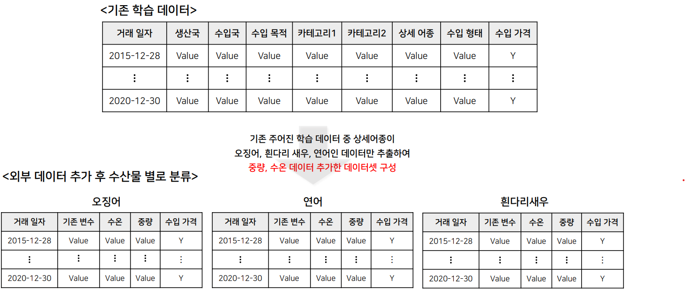
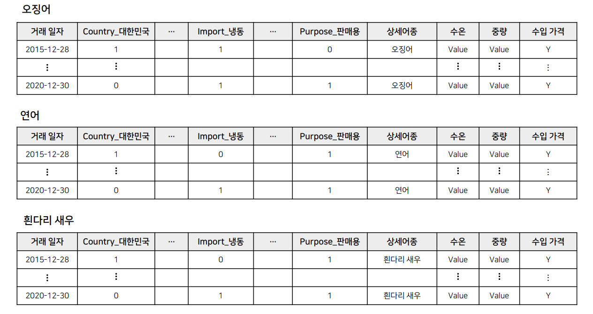
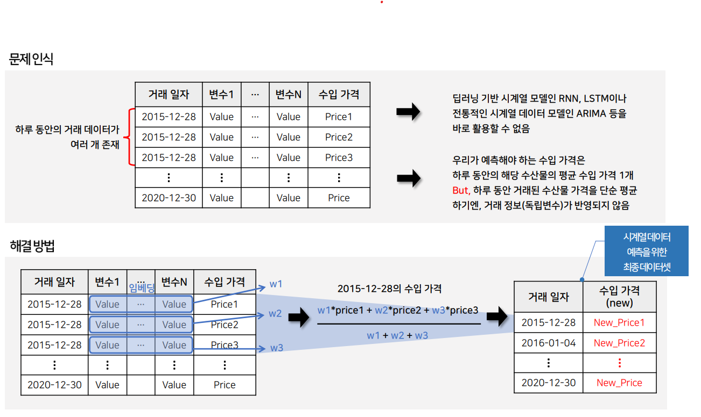
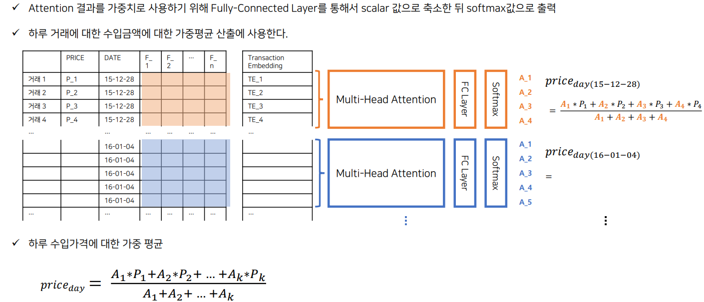
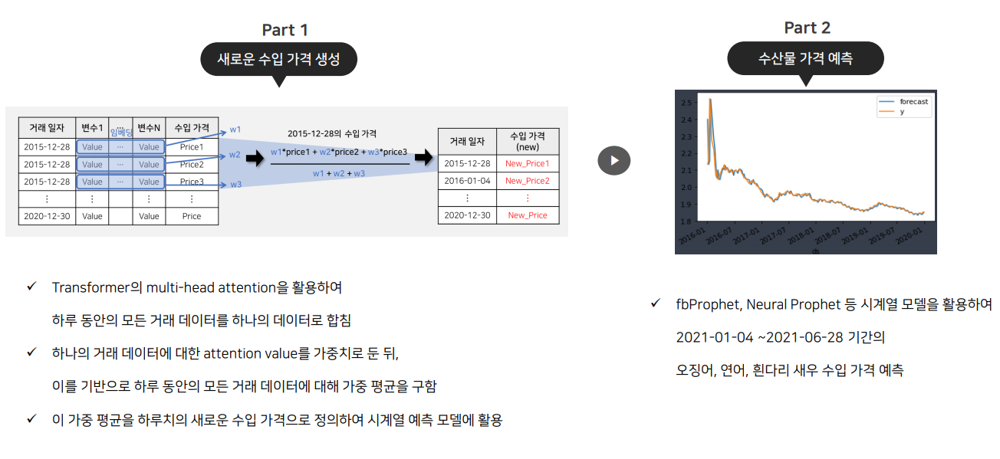
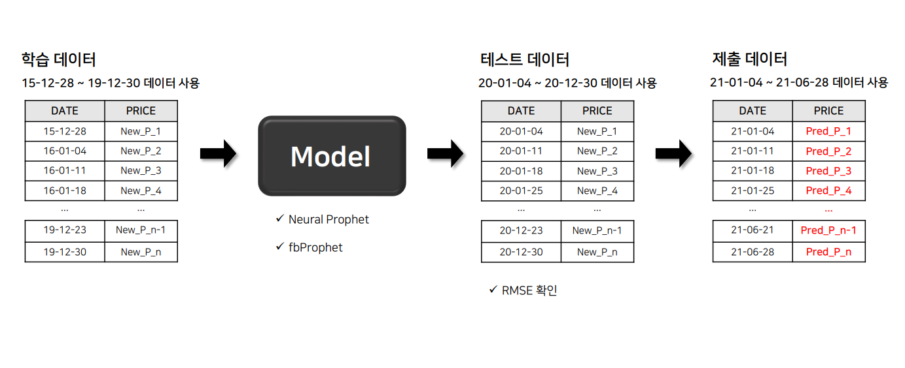

# Prediction of seafood import price using attention method
<p align="center">
  
</p>

2021 빅콘테스트 챔피언 리그 - 수산물 Biz 분야 본선 진출


## 과제 : 수산물 수입가격 예측을 통한 최적의 가격 예측 모형 도출
<p align="center">
  
</p>

### 분석방향 
- 계절성을 반영 : 해당 수산물 생산국가의 수온 데이터 
- 수산물의 공급량 반영 : 해당 거래의 중량 데이터 
- 기존 데이터 + 수온 데이터 & 중량 데이터 수집 -> **계절성과 수산물의 공급량을 반영한 수산물 수입가격 예측 모델 생성** 


## 데이터 수집 
<p align="center">
  
</p>

- 중량 데이터의 경우, 거래 정보가 모두 일치하는 경우에만 사용할 수 있기 때문에, **기존 데이터에서 중량 데이터와 거래 정보가 일치하는 데이터만 사용**


## 데이터 전처리
<p align="center">
  
</p>

- 카테고리형 변수 -> one-hot encoding 
- 수입 형태(import type) feature의 경우 쉼표(,)를 기준으로 카테고리를 분류 한 뒤, 해당 카테고리 존재하면 1, 존재하지 않으면 0으로 처리
- 생산국, 수입국 feature의 경우 하나의 country list로 합친 뒤, 해당 국가가 제조국 또는 수입국이면 1, 아니면 0 (ex : 생산국 - 칠레, 수입국 - 칠레 -> [칠레, 칠레])


## 아이디어 
<p align="center">
  
</p>

- Attention 방법을 사용하여, 한 날짜에 대한 거래들의 attention value를 생성하고, 이를 가중합 의 가중치로 사용 
### 예시 
<p align="center">
  
</p>

## 모델링 과정 
<p align="center">
  
</p>


## 가격 예측 
<p align="center">
  
</p>

- Attetion 방법을 사용하여 하루 단위의 수입가격 생성 
- 시계열 모델 (facebook-prophet & neural-prophet) 을 사용하여 20-01-04 ~ 20-12-30 rmse validation test 진행 
- rmse가 가장 낮은 모델을 선정하여 prediction 진행

### 예측 결과 

#### 1). 오징어 


## Requirements
```
tensorflow>=2.x
keras
prophet
neuralprophet 
```
